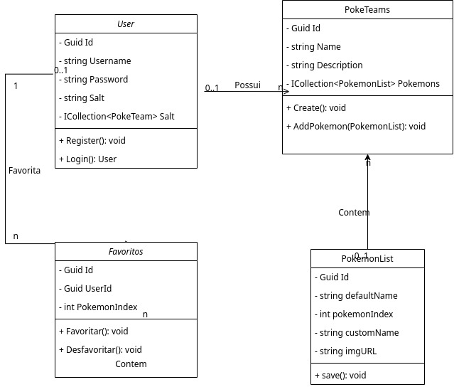
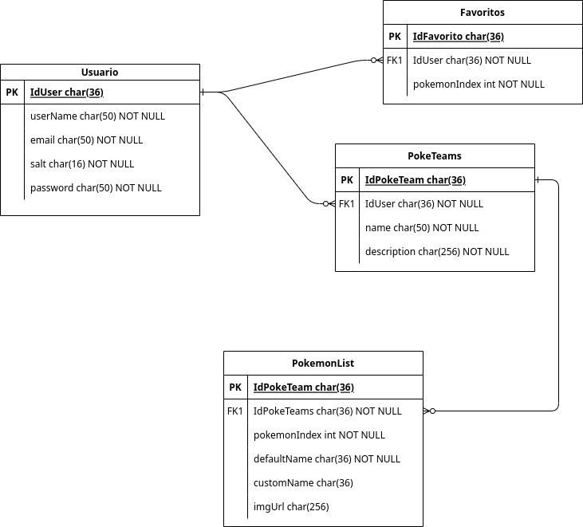
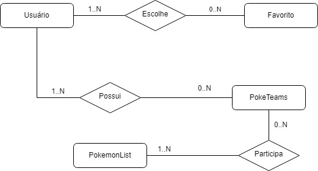

# PokeJournal-API
Api para aplicação [Poke Journal](https://github.com/lu-css/Pokejournal/).

URL para acesso `https://pokejournal-api.onrender.com/`

### 3°A Etim - Desenvolvimento de Sistemas
> Débora Liberato Ribeiro (づ｡◕‿‿◕｡)づ 
> Lucas dos Santos Silva ⊂◉‿◉つ

## Descrição das atualizações de informação no aplicativo PokéJournal (API)

As novas funcionalidades são “Favoritar” e “Adicionar equipe” ambos relacionados com a criação da nova API, o botão para primeira função citada já foi criado anteriormente, porém não apresentava funcionamento. Nossos planos agora para a API são criar um EndPoint que salvará um Pokémon como favorito. Para a criação das equipes outro EndPoint  permitirá a adição de até cinco Pokémons.

## Diagramas

## Diagrama de classes

## DER

